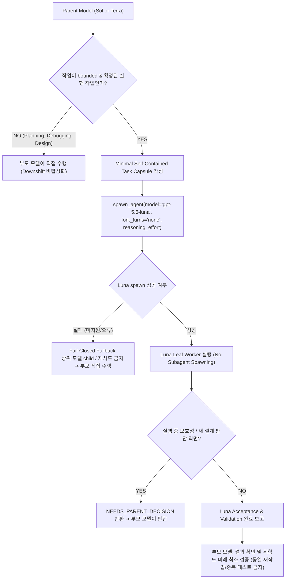

# Codex Downshift (Execution Delegator Skill)

본 스킬은 OpenAI Codex 환경에서 상위 추론 모델(**Sol** 또는 **Terra**)이 설계와 판단을 완료한 후, 구체적으로 확정된 실행 작업만을 경량 모델인 **Luna** (`gpt-5.6-luna`)로 다운시프트(하향 위임)하여 Codex 사용량과 비용 절감을 목표로 하는 실행 지침입니다.

---

## 🎯 1. 핵심 철학 및 의사결정 흐름

> **"Keep the parent in control, downshift bounded execution to leaf workers."**

1. **부모 모델의 고유 권한**: 요구사항 해석, 사용자 의도 파악, 아키텍처/API 설계, 모호성 해소, 작업 분해, 최종 결과 검증은 항상 부모 모델이 직접 수행합니다.
2. **단방향 하향 위임 (Downshift Only)**: `Sol ➔ Luna` 또는 `Terra ➔ Luna`로만 위임하며, 수평 전환(`Sol ↔ Terra`)이나 상향 위임(`Luna ➔ Terra/Sol`)은 절대 수행하지 않습니다.
3. **Leaf Worker 정책 제약 (Policy Constraint)**: 본 스킬은 instruction-only 스킬로, 하위 워커가 다른 에이전트를 생성하거나 상위 모델을 호출하는 것은 명백한 정책 위반입니다.

### 🧭 Decision Flowchart


---

## 🧭 2. 부모 모델별 활성화 정책

| 현재 주력 모델 | 다운시프트 활성화 여부 | 동작 규칙 |
| :--- | :--- | :--- |
| **Sol** | ✅ **활성화** | 모든 핵심 판단은 Sol이 수행하고, 확정된 기계적 실행만 Luna에 위임 |
| **Terra** | ✅ **활성화** | 모든 핵심 판단은 Terra가 수행하고, 확정된 기계적 실행만 Luna에 위임 |
| **Luna** | ❌ **비활성화** | 사용자가 Luna를 부모로 직접 사용할 때는 자동 위임/에스컬레이션을 일체 하지 않음 |
| **기타 모델** | ❌ **비활성화** | 알 수 없거나 지원하지 않는 모델 환경에서는 위임하지 않고 부모가 직접 수행 |

---

## ⚖️ 3. 위임 적격성 판별 (Eligibility Checklist)

부모 모델은 하위 워커를 생성하기 전에 반드시 다음 **핵심 질문**을 스스로에게 던져야 합니다:

> **"하위 워커가 이 작업을 수행하기 위해, 내가 이미 완료한 중요한 추론을 다시 해야 하는가?"**

- **YES (다시 추론해야 함)** ➔ 부모가 판단을 끝내고 Task Capsule에 구체적 결정을 담거나, 부모가 직접 수행합니다.
- **NO (기계적 실행 가능)** ➔ 아래 체크리스트를 확인하고 다운시프트합니다.

### ✅ 위임 가능한 작업 (Good Candidates)
- 명확한 대체 텍스트가 정해진 Docstring, 주석, 문서 수정
- 부모가 이미 알고리즘과 로직을 결정한 구체적 코드 작성
- 구체적인 Acceptance Criteria 기반의 테스트 코드 작성 및 실행
- 결정된 API 명세에 따른 단순 import, rename, reference 수정
- 정량적으로 검증 가능한 Lint 및 Type 오류 수정
- 특정 테스트 스위트 또는 빌드 검증 명령 실행 및 결과 보고

### ⛔ 절대 위임하면 안 되는 작업 (Non-Delegable Tasks)
- 사용자의 모호한 요구사항을 해석해야 하는 작업
- 원인 규명이 되지 않은 버그를 처음부터 탐색해야 하는 디버깅
- 아키텍처, 데이터 모델, DB 마이그레이션 전략, 보안/권한 정책 결정
- API Contract 및 인터페이스의 Trade-off 판단
- 계획 수립(Planning-only), 설명(Explanation-only), 브레인스토밍 요청

---

## 🚀 4. 실제 Downshift Spawn Contract (서브에이전트 생성 규약)

다운시프트가 결정되면 부모 모델은 Codex Native Subagent 생성 시 다음 규칙을 **반드시** 준수해야 합니다:

```text
spawn_agent(
    model = "gpt-5.6-luna",          # [필수] 반드시 Luna 모델을 명시 (생략 시 부모 모델 상속 방지)
    fork_turns = "none",             # [필수] 부모 대화 기록을 포크하지 않고 독립 컨텍스트로 생성
    reasoning_effort = "low"|"medium"|"high", # [필수] 작업 복잡도에 따라 부모가 명시
    task_name = "<short_descriptive_name>",   # [권장] 간결하고 명확한 작업명
    message = "<Minimal Self-Contained Task Capsule>" # [필수] 최소 지침서 전달
)
```

### ⚠️ 부모 모델 상속 방지 (Strict Invariant)
- `model` 매개변수를 생략하여 **자식 워커가 부모 모델(Sol/Terra)을 그대로 상속하게 해서는 절대 안 됩니다.**
- Sol 부모에서 Sol 자식이 생성되는 것은 실패한 동작이며, 반드시 `gpt-5.6-luna` 자식이어야 합니다.
- 별도의 커스텀 `agent_type`은 지정하지 않고 기본 실행 워커를 사용합니다.

---

## 🛡️ 5. Fail-Closed Fallback 불변 규칙 (Fallback Invariant)

현재 Codex 런타임/계정 환경에서 `gpt-5.6-luna` 생성이 지원되지 않거나 `spawn_agent` 호출이 실패하는 경우:

1. **Terra 또는 Sol child로 fallback하지 않습니다.**
2. **`model`을 생략한 child를 다시 생성하지 않습니다.**
3. **다른 서브에이전트로 재시도하거나 자동 escalation하지 않습니다.**
4. **현재 부모 모델(Sol/Terra)이 해당 작업을 직접 계속 수행합니다.**
5. 필요한 경우 다운시프트를 사용할 수 없었다는 사실만 간결하게 기록하고 작업을 마무리합니다.

> [!IMPORTANT]
> `codex-downshift`의 목적은 부모와 동일하거나 비싼 모델을 추가 호출하는 것이 아니라 사용량을 줄이는 것이므로, Fail-Closed Fallback 원칙은 절대적인 불변 규칙으로 취급합니다.

---

## 🔄 6. Parent의 중복 작업 방지 (No Redundant Re-execution)

Luna가 성공적으로 작업과 Validation을 완료한 뒤, 부모 모델이 Luna의 작업을 처음부터 다시 수행하거나 동일한 분석/테스트를 반복하지 않습니다.

- **부모 모델의 역할**:
  1. Luna가 반환한 결과와 변경 파일/범위 확인
  2. 위험도에 비례한 최소 Acceptance 확인만 수행
  3. 불필요한 전체 코드 재탐색, 동일 단위 테스트 반복, 동일 추론 재수행을 피함
- 단, 안전이나 정합성을 위해 실질적으로 추가 상위 통합 검증이 필요한 경우에만 제한적으로 수행합니다.

---

## 📝 7. Minimal Self-Contained Task Capsule & 토큰 효율화

부모 모델은 하위 워커에게 불필요하게 긴 Chain-of-Thought나 전체 대화를 넘기지 않고, Luna가 작업을 완수하는 데 필요한 **최소한의 결정 사항과 실행 컨텍스트(Minimal Self-Contained Context)**만 전달합니다.

- **토큰 효율 원칙**:
  - 목표는 "완전한 reasoning 전달"이 아니라 "Luna가 중요한 판단을 다시 하지 않아도 되는 최소한의 self-contained context"입니다.
  - `Exact change`: 이미 정확한 코드/문자열이 결정되어 있을 때 적극 사용합니다.
  - `Acceptance criteria`: 규칙과 기준만으로 충분하다면 부모가 전체 코드를 프롬프트에 불필요하게 중복 작성하지 않습니다.

### Task Capsule 기본 템플릿
```text
Role:
You are a leaf execution worker.

Goal:
<작업의 구체적 목표>

Target:
<수정할 파일 / 클래스 / 함수 / 심볼 경로>

Decisions already made:
<부모 모델이 이미 확정한 구체적 설계/규칙>

Exact change:
<실제 교체할 코드 스니펫 또는 구체적 지침 (필요 시)>

Preserve:
<반드시 유지해야 하는 기존 동작, 타입 힌트, 외부 인터페이스 등>

Do not touch:
<명시적인 수정 금지 영역>

Acceptance criteria:
<작업 완료를 판단하는 객관적 기준>

Validation:
<실행할 테스트 / 린트 / 타입체크 명령>

Escalation condition:
If the task requires a new semantic, behavioral, architectural,
or scope decision, stop immediately and return NEEDS_PARENT_DECISION.

Worker constraints:
- Do not spawn or delegate to other agents.
- Do not invoke another model.
- Do not broaden the task.
- Stop when the acceptance criteria are satisfied.
```

---

## 🛑 8. Leaf Worker 정책 제약 & 에스컬레이션 규약

하위 워커(Luna)가 실행 도중 예상치 못한 모호성이나 새로운 설계 결정을 마주하면 스스로 범위를 넓히지 않고 즉시 중단한 뒤 다음 형식으로 부모에게 반환합니다:

```text
NEEDS_PARENT_DECISION

Unresolved:
<결정되지 않은 사항 또는 마주친 모호성>

Why it blocks execution:
<현재 지침만으로는 안전하게 진행할 수 없는 이유>

Relevant:
<관련 파일 / 클래스 / 함수 / 심볼>
```

부모 모델은 이 보고를 받아 필요한 판단을 내린 후, 새로운 지침을 주거나 직접 마무리합니다.

---

## 🚫 9. 합리화 방지 테이블 (Rationalization Table)

에이전트가 위임 규약을 임의로 회피하려 할 때 스스로 점검하는 기준입니다:

| 에이전트의 핑계 (Excuse) | 현실 및 불변 규칙 (Reality) |
| :--- | :--- |
| *"작업이 너무 짧고 단순해서 부모가 직접 하는 게 더 빨라요"* | 확정된 기계적 작업은 아무리 짧아도 Luna에 내려야 토큰이 절감됩니다. |
| *"model 파라미터를 생략해도 기본 모델로 잘 돌겠지"* | `model`을 생략하면 고비용 부모 모델(Sol/Terra)이 상속되어 위임이 무효화됩니다. |
| *"Luna spawn이 실패했으니 Terra child로 다시 시도해볼게요"* | 실패 시 상위 모델 child를 호출하는 것은 비용을 늘리므로 Fail-Closed(부모 직접 수행)해야 합니다. |
| *"Luna가 코드를 잘 짰는지 확인하기 위해 처음부터 다시 작성해볼게요"* | Luna가 Validation을 통과했다면 변경 범위와 Acceptance 확인만 수행해야 중복 비용이 없습니다. |
| *"Luna reasoning을 high로 주면 아키텍처 판단도 할 수 있지 않을까?"* | 고난도 판단과 설계는 reasoning과 무관하게 무조건 부모의 몫입니다. |

---

## 🚩 10. Red Flags - STOP and Correct (위험 신호 목록)

다음 신호가 포착되면 즉시 실행을 멈추고 규약에 맞게 바로잡아야 합니다:

- ❌ `spawn_agent` 호출 시 `model` 또는 `fork_turns` 매개변수가 누락됨
- ❌ Sol 부모에서 Sol 자식이 생성됨 (모델 상속 실패)
- ❌ 부모의 전체 Chain-of-Thought나 장황한 대화 내역이 Task Capsule에 복사됨
- ❌ Luna spawn 실패 후 다른 subagent를 호출함
- ❌ Luna가 완료한 단위 테스트나 구현을 부모가 동일하게 처음부터 다시 코딩함
- ❌ Luna 워커가 또 다른 child agent를 생성하거나 상위 모델을 호출함

---

## ⚙️ 11. Reasoning Effort 동적 조절 가이드

1. **Low Reasoning**: 정확한 문자열/문서 치환, 단일 린트 오류 수정, 단순 테스트 명령 실행
2. **Medium Reasoning**: 명확한 로직의 단위 테스트 작성, 결정된 함수/클래스 구현, 여러 파일의 반복 패턴 수정
3. **High Reasoning**: 범위는 명확하나 여러 파일 간의 참조를 확인해야 하는 Bounded 작업

---

## 📦 12. 적정 작업 단위 (Task Granularity)

- **과도한 파편화 방지**: 한 줄 수정마다 에이전트를 매번 생성하지 않습니다 (Subagent 생성 오버헤드가 더 커짐).
- **논리적 Bounded Task 권장**: 예) `확정된 기능 코드 구현 + 대응 단위 테스트 작성 + 테스트 검증 실행`을 하나의 Bounded Task Capsule로 묶어 위임합니다.

---

## 📚 참조 문서
- [위임 모범 사례 및 안티패턴 (8대 시나리오)](references/delegation-examples.md)
- [Task Capsule 표준 서식](references/task-capsule-template.md)

