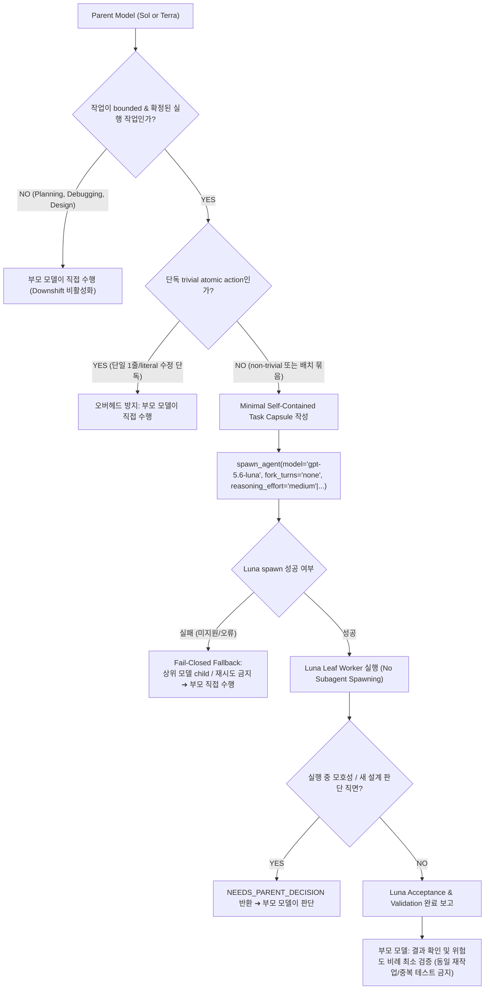

# Codex Downshift (Execution Delegator Skill)

본 스킬은 OpenAI Codex 환경에서 상위 추론 모델(**Sol** 또는 **Terra**)이 설계와 판단을 완료한 후, 구체적으로 확정된 실행 작업만을 **Luna** (`gpt-5.6-luna`)로 다운시프트(하향 위임)하여 Codex 사용량과 비용 절감을 목표로 하는 실행 지침입니다.

---

## 🎯 1. 핵심 철학 및 의사결정 흐름

> **"Keep the parent in control, downshift bounded execution to Luna."**

1. **부모 모델의 고유 권한**: 요구사항 해석, 사용자 의도 파악, 아키텍처/API 설계, 모호성 해소, 작업 분해, 최종 결과 검증은 항상 부모 모델이 직접 수행합니다.
2. **단방향 하향 위임 (Downshift Only)**: `Sol ➔ Luna` 또는 `Terra ➔ Luna`로만 위임하며, 수평 전환(`Sol ↔ Terra`)이나 상향 위임(`Luna ➔ Terra/Sol`)은 절대 수행하지 않습니다.
3. **Leaf Worker 정책 제약 (Policy Constraint)**: 본 스킬은 instruction-only 스킬로, 하위 워커가 다른 에이전트를 생성하거나 상위 모델을 호출하는 것은 명백한 정책 위반입니다.

### 🧭 Decision Flowchart


---

## 🧭 2. 부모 모델별 활성화 정책

| 현재 주력 모델 | 다운시프트 활성화 여부 | 동작 규칙 |
| :--- | :--- | :--- |
| **Sol** | ✅ **활성화** | 모든 핵심 판단은 Sol이 수행하고, 확정된 기계적 실행만 Luna에 위임 |
| **Terra** | ✅ **활성화** | 모든 핵심 판단은 Terra가 수행하고, 확정된 기계적 실행만 Luna에 위임 |
| **Luna** | ❌ **비활성화** | 사용자가 Luna를 부모로 직접 사용할 때는 자동 위임/에스컬레이션을 일체 하지 않음 |
| **기타 모델** | ❌ **비활성화** | 알 수 없거나 지원하지 않는 모델 환경에서는 위임하지 않고 부모가 직접 수행 |

---

## ⚖️ 3. 위임 적격성 판별 (Eligibility & Safety Signals)

부모 모델은 하위 워커를 생성하기 전에 반드시 다음 **핵심 질문**을 스스로에게 던져야 합니다:

> **"하위 워커가 이 작업을 수행하기 위해, 내가 이미 완료한 중요한 추론을 다시 해야 하는가?"**

- **YES (다시 추론해야 함)** ➔ 부모가 판단을 끝내고 Task Capsule에 구체적 결정을 담거나, 부모가 직접 수행합니다.
- **NO (기계적 실행 가능)** ➔ 아래 **8대 기본 필수 요건**과 **3대 안전성 보조 신호(Safety Signals)**를 확인하고 다운시프트합니다.

### 📋 8대 기본 필수 요건 (Baseline Requirements)
위임 후보가 되려면 다음 조건을 만족해야 합니다:
1. **수정 목적 명확성**: 무엇을 왜 바꾸는지 명확히 정의되어 있음
2. **대상 특정 가능성**: 대상 파일, 클래스, 함수, 심볼을 충분히 특정할 수 있음
3. **기대 동작 확정**: 구체적인 기대 동작과 입출력이 이미 결정되어 있음
4. **구현 결정 완료**: 중요한 설계 및 알고리즘 결정이 부모 모델에서 끝남
5. **선택지 배제**: 다른 합리적인 구현 대안 중 하나를 Luna가 스스로 고민하고 선택할 필요가 없음
6. **Acceptance Criteria 완비**: 작업 완료를 객관적으로 판별할 기준이 명확함
7. **결정적 검증 수단**: 테스트, 린트, 타입체크 등 결과를 검증할 명확한 방법이 있음
8. **제한적 실패 영향**: 실패하더라도 범위가 국소적이고 부모가 결과를 쉽게 검토·롤백할 수 있음

### Semantic Decision Closure

Downshift는 미완성된 의미적 판단을 Luna에 넘기는 수단이 아닙니다. 부모 모델은 spawn 전에 결과의 의미, 동작, 범주 및 외부 계약을 확정하고, Luna에는 그 결정을 적용하고 검증하는 실행 판단만 남겨야 합니다.

다음 중 하나라도 필요하면 Task Capsule은 아직 준비되지 않은 것으로 봅니다:

- 제품 의미, 정책, 범주 또는 공개 계약 선택
- 여러 합리적인 동작이나 결과 형태 중 하나의 선택
- PRD, ADR 또는 대화 기록을 읽고 요구사항을 새로 해석
- 서로 구분된 범주를 합치거나 나눌지 판단
- `자연스럽게`, `적절하게`, `알아서`처럼 허용 결과를 결정하지 못하는 주관적 Acceptance Criteria 해석

이 경우 부모가 결정을 완료해 Task Capsule을 구체화하거나 작업을 직접 수행합니다. 파일 탐색, patch 적용, 코드 조립 및 확정된 동작 안에서의 테스트 실패 분석 같은 bounded execution reasoning은 허용됩니다.

### 🛡️ 3대 안전성 보조 신호 (Safety Signals Checklist)
*(숫자 스코어 엔진을 사용하지 않으며, 정성적 판단 체크리스트로 확인합니다)*

| 안전 신호 | ✅ Luna 다운시프트 적격 (Good) | ⛔ 부모 직접 수행 (Parent Direct) |
| :--- | :--- | :--- |
| **Coupling (결합도)** | • 수정 범위가 국소적임<br>• 영향 범위를 명확하게 특정 가능<br>• 타 컴포넌트까지 판단할 필요 없음 | • 여러 서브시스템에 강하게 결합됨<br>• 변경 영향 범위를 확신하기 어려움<br>• 타 인터페이스/데이터 흐름 추가 판단 필요 |
| **Verification (검증성)** | • 특정 테스트, lint, typecheck로 결정적 검증 가능<br>• 명확한 Acceptance Criteria 존재 | • 검증 방법이 모호함<br>• 결과 판단이 주관적임 |
| **Consequence (영향도)** | • 실패 영향이 국소적이고 제한적임<br>• 변경을 쉽게 되돌릴 수 있음 (가역적)<br>• 부모가 결과를 즉시 검토 가능 | • 보안, 권한, 데이터 손실 위험<br>• 호환성 파괴, migration, 외부 공개 API<br>• 운영 환경 변경 등 Blast Radius가 큼 |

### ✅ 위임 가능한 작업 예시 (Good Candidates)
- 명확한 대체 텍스트가 정해진 Docstring, 주석, 문서 수정
- 부모가 이미 알고리즘과 로직을 결정한 구체적 코드 작성
- 구체적인 Acceptance Criteria 기반의 테스트 코드 작성 및 실행
- 결정된 API 명세에 따른 단순 import, rename, reference 수정
- 정량적으로 검증 가능한 Lint 및 Type 오류 수정
- 특정 테스트 스위트 또는 빌드 검증 명령 실행 및 결과 보고

### ⛔ 절대 위임하면 안 되는 작업 (Non-Delegable Tasks)
- 사용자의 모호한 요구사항을 해석해야 하는 작업
- 원인 규명이 되지 않은 버그를 처음부터 탐색해야 하는 디버깅
- 아키텍처, 데이터 모델, DB 마이그레이션 전략, 보안/권한 정책 결정
- API Contract 및 인터페이스의 Trade-off 판단
- 계획 수립(Planning-only), 설명(Explanation-only), 브레인스토밍 요청

---

## 🚀 4. 실제 Downshift Spawn Contract (서브에이전트 생성 규약)

다운시프트가 결정되면 부모 모델은 Codex Native Subagent 생성 시 다음 규칙을 **반드시** 준수해야 합니다:

```text
spawn_agent(
    model = "gpt-5.6-luna",          # [필수] 반드시 Luna 모델을 명시 (생략 시 부모 모델 상속 방지)
    fork_turns = "none",             # [필수] 부모 대화 기록을 포크하지 않고 독립 컨텍스트로 생성
    reasoning_effort = "medium",     # [필수] 기본값은 medium, 작업에 따라 low/medium/high 명시
    task_name = "<short_descriptive_name>",   # [권장] 간결하고 명확한 작업명
    message = "<Minimal Self-Contained Task Capsule>" # [필수] 최소 지침서 전달
)
```

### ⚠️ 부모 모델 상속 방지 (Strict Invariant)
- `model` 및 `reasoning_effort` 매개변수를 생략하여 **자식 워커가 부모 모델(Sol/Terra)의 속성을 그대로 상속하게 해서는 절대 안 됩니다.**
- Sol 부모에서 Sol 자식이 생성되거나, Terra 부모에서 Terra 자식이 생성되는 것은 실패한 동작이며, 반드시 `gpt-5.6-luna` 자식이어야 합니다.
- 별도의 커스텀 `agent_type`은 지정하지 않고 기본 실행 워커를 사용합니다.

---

## 🛡️ 5. Fail-Closed Fallback 불변 규칙 (Fallback Invariant)

현재 Codex 런타임/계정 환경에서 `gpt-5.6-luna` 생성이 지원되지 않거나 `spawn_agent` 호출이 실패하는 경우:

1. **Terra 또는 Sol child로 fallback하지 않습니다.**
2. **`model`을 생략한 child를 다시 생성하지 않습니다.**
3. **다른 서브에이전트로 재시도하거나 자동 escalation하지 않습니다.**
4. **현재 부모 모델(Sol/Terra)이 해당 작업을 직접 계속 수행합니다.**
5. 필요한 경우 다운시프트를 사용할 수 없었다는 사실만 간결하게 기록하고 작업을 마무리합니다.

> [!IMPORTANT]
> `codex-downshift`의 목적은 부모와 동일하거나 비싼 모델을 추가 호출하는 것이 아니라 사용량을 줄이는 것이므로, Fail-Closed Fallback 원칙은 절대적인 불변 규칙으로 취급합니다.

---

## 🔄 6. Parent의 중복 작업 방지 및 Lifecycle 종료 확인

Luna가 성공적으로 작업과 Validation을 완료한 뒤, 부모 모델은 다음 규칙을 준수합니다:

1. **중복 작업 방지 (No Redundant Re-execution)**:
   - Luna가 반환한 결과와 변경 파일/범위 확인
   - 위험도에 비례한 최소 Acceptance 확인만 수행
   - 불필요한 전체 코드 재탐색, 동일 단위 테스트 반복, 동일 추론 재수행을 피함
2. **Child Lifecycle 종료 확인 (Lifecycle Termination)**:
   - 부모 모델이 사용자에게 최종 완료를 응답하기 전, 이번 요청에서 생성된 Luna worker가 terminal state에 도달했는지 확인합니다.
   - 완료된 worker를 이유 없이 다시 사용하지 않으며, 더 이상 필요하지 않은 worker가 불필요하게 계속 실행되지 않도록 합니다. (별도 런타임 없이 프롬프트 지침 수준으로 관리)

---

## 📝 7. Minimal Self-Contained Task Capsule & Validation Budget

부모 모델은 하위 워커에게 불필요하게 긴 Chain-of-Thought나 전체 대화를 넘기지 않고, Luna가 작업을 완수하는 데 필요한 **최소한의 결정 사항과 실행 컨텍스트(Minimal Self-Contained Context)**만 전달합니다.

### ⏱️ Validation Budget & Recovery Limit (최대 1회 복구)
- **Validation Budget**: Acceptance criteria를 입증하는 데 필요한 최소한의 검증만 수행하며, 동일 목적의 테스트/린트를 이유 없이 반복하지 않습니다.
- **Recovery Limit (Max 1 Attempt)**: 
  - Validation 실패가 Luna 자신의 bounded 구현 실수이고 수정 방법이 명확한 경우에 한해 **최대 1회의 recovery attempt만 허용**합니다.
  - 1회 복구 후에도 실패하면 무한 루프를 돌지 않고 즉시 현재 상태와 실패 원인을 부모에게 반환합니다.
  - 새로운 의미적/아키텍처 판단이 필요한 경우에는 recovery를 시도하지 않고 즉시 `NEEDS_PARENT_DECISION`을 반환합니다.

### Task Capsule 기본 템플릿

부모는 작성 전에 결과의 의미·동작·범주가 확정되었는지, Luna에 제품·정책 선택이 남지 않았는지, 정확한 표현이 계약이면 `Exact change`가 있는지, Acceptance criteria가 의미적 불변조건을 검증하는지 확인합니다. 이 parent-only check는 child message에 포함하지 않습니다.

```text
Role:
You are a leaf execution worker.

Goal:
<작업의 구체적 목표>

Target:
<수정할 파일 / 클래스 / 함수 / 심볼 경로>

Decisions already made:
<부모 모델이 이미 확정한 구체적 설계/규칙>

Exact change:
<정확한 결과 형태가 계약이면 필수: final text, before/after 또는 결정적인 변환 규칙>

Preserve:
<반드시 유지해야 하는 기존 동작, 타입 힌트, 외부 인터페이스 등>

Do not touch:
<명시적인 수정 금지 영역>

Acceptance criteria:
<의미·범주·동작·호환성 불변조건과 기계적 검증 결과>

Validation:
<실행할 테스트 / 린트 / 타입체크 명령 (필요한 최소한만)>

Recovery policy:
If validation fails due to your own minor implementation error, you may attempt at most ONE recovery. If it still fails, return failure details immediately.

Escalation condition:
- If new semantic/behavioral/architectural judgment is needed: return NEEDS_PARENT_DECISION.
- If external side-effects (git push, deploy, secrets, elevated actions) are needed: return NEEDS_PARENT_ACTION.

Worker constraints:
- Do not spawn or delegate to other agents.
- Do not invoke another model.
- Do not perform external side-effects or destructive operations.
- Stop when acceptance criteria are satisfied.
```

---

## 🛑 8. Leaf Worker 제약 & 2대 에스컬레이션 프로토콜

하위 워커(Luna)는 bounded implementation worker이므로, 다음 2가지 상황에서 독단적으로 진행하지 않고 즉시 부모에게 작업을 반환합니다:

### 1) 새로운 설계/의미적 판단 직면 시 (`NEEDS_PARENT_DECISION`)
```text
NEEDS_PARENT_DECISION

Unresolved:
<결정되지 않은 사항 또는 마주친 모호성>

Why it blocks execution:
<현재 지침만으로는 안전하게 진행할 수 없는 이유>

Relevant:
<관련 파일 / 클래스 / 함수 / 심볼>
```

### 2) 외부 부수효과 / 승인 필요 작업 직면 시 (`NEEDS_PARENT_ACTION`)
Luna는 `git push`, remote branch 변경, merge, deploy, publish, release, 외부 메시지 전송, production 변경, secret/credential 작업, destructive/elevated 작업을 직접 수행할 수 없습니다.
```text
NEEDS_PARENT_ACTION

Action required:
<필요한 외부 부수효과 또는 승인 작업>

Why needed:
<해당 작업이 필요한 이유>

Task completed so far:
<현재까지 완료된 로컬 파일 수정 및 검증 내용>
```

---

## 🚫 9. 합리화 방지 테이블 (Rationalization Table)

에이전트가 위임 규약을 임의로 회피하려 할 때 스스로 점검하는 기준입니다:

| 에이전트의 핑계 (Excuse) | 현실 및 불변 규칙 (Reality) |
| :--- | :--- |
| *"작업이 조금 단순해 보이니 부모가 계속하는 게 더 빠르지 않나요?"* | 단순 '부모 속도(Latency)'를 이유로 non-trivial 작업을 부모가 수행해서는 안 됩니다. **Latency보다 Parent Usage 절감이 우선**입니다. (단, 단일 trivial atomic action 단독 제외) |
| *"결합도가 높지만 Luna reasoning을 high로 주면 알아서 잘 고치겠죠?"* | 다중 서브시스템 결합이나 Blast Radius가 큰 작업은 reasoning과 무관하게 **부모가 직접 수행**해야 합니다. |
| *"테스트가 계속 실패하니 고칠 때까지 4~5번 반복 수정해볼게요"* | 토큰 낭비 방지를 위해 **최대 1회 복구(Recovery)**만 허용되며, 미해결 시 즉시 부모에게 반환해야 합니다. |
| *"Luna가 원격 배포나 git push까지 완료하면 편리하지 않을까요?"* | Luna는 로컬 bounded worker이므로 외부 부수효과는 반드시 **`NEEDS_PARENT_ACTION`**으로 에스컬레이션해야 합니다. |
| *"model 파라미터를 생략해도 기본 모델로 잘 돌겠지"* | `model`을 생략하면 고비용 부모 모델(Sol/Terra)이 상속되어 위임이 무효화됩니다. 반드시 `gpt-5.6-luna`를 명시해야 합니다. |
| *"Luna spawn이 실패했으니 Terra child로 다시 시도해볼게요"* | 실패 시 상위 모델 child를 호출하는 것은 비용을 늘리므로 Fail-Closed(부모 직접 수행)해야 합니다. |
| *"Luna가 코드를 잘 짰는지 확인하기 위해 처음부터 다시 작성해볼게요"* | Luna가 Validation을 통과했다면 변경 범위와 Acceptance 확인만 수행해야 중복 비용이 없습니다. |
| *"Luna reasoning을 high로 주면 아키텍처 판단도 할 수 있지 않을까?"* | 고난도 판단과 설계는 reasoning과 무관하게 무조건 부모의 몫입니다. |

---

## 🚩 10. Red Flags - STOP and Correct (위험 신호 목록)

다음 신호가 포착되면 즉시 실행을 멈추고 규약에 맞게 바로잡아야 합니다:

- ❌ `spawn_agent` 호출 시 `model`, `fork_turns`, `reasoning_effort` 매개변수가 누락됨
- ❌ Sol 부모에서 Sol 자식 또는 Terra 부모에서 Terra 자식이 생성됨 (모델 상속 실패)
- ❌ 부모의 전체 Chain-of-Thought나 장황한 대화 내역이 Task Capsule에 복사됨
- ❌ 보안, 권한, 마이그레이션 등 Blast Radius가 큰 작업이 Luna에 위임됨
- ❌ Luna가 2회 이상 반복적으로 테스트 실패를 수정하며 루프를 돎 (Recovery 1회 제한 위반)
- ❌ Luna 워커가 `git push`, deploy, secret 등 외부 부수효과 작업을 직접 실행함
- ❌ Luna 워커가 또 다른 child agent를 생성하거나 상위 모델을 호출함
- ❌ Luna spawn 실패 후 다른 subagent를 호출하거나 재시도함
- ❌ Luna가 완료한 단위 테스트나 구현을 부모가 동일하게 처음부터 다시 코딩함
- ❌ 작은 한 줄 수정마다 별도의 Luna child를 여러 번 연속 생성함 (과도한 파편화)

---

## ⚙️ 11. Luna Reasoning Effort 선택 정책

부모 모델은 작업 성격에 맞게 `low`, `medium`, `high` 중 하나를 반드시 명시적으로 선택합니다. (부모 모델의 reasoning effort를 암묵적으로 상속하지 않습니다.)

- **기본값**: `medium`

### 선택 기준
1. **Low**: 정확한 문자열 또는 코드 교체, 매우 기계적인 반복 수정, 판단이 전혀 필요하지 않은 작은 bounded task
2. **Medium (기본값)**: 일반적인 명확한 구현 작업, 명확하게 정의된 테스트 작성 + 구현, 제한된 범위의 코드 탐색
3. **High**: 범위와 동작은 이미 확정되어 있고 여러 파일 수정 또는 로컬 코드 탐색이 필요하지만 새로운 의미적/아키텍처 판단은 불필요한 작업

### Reasoning Effort Does Not Expand Authority

`low`, `medium`, `high`는 확정된 작업을 실행하는 데 필요한 탐색과 구현 복잡도만 나타냅니다. Reasoning effort를 높여도 새로운 요구사항 해석, 제품·아키텍처·공개 API·호환성 정책 결정, 문서 범주 변경 또는 Task Capsule에 없는 동작 선택 권한은 추가되지 않습니다.

`high`에서도 새로운 의미적 판단이 필요해지면 effort를 더 높이거나 독자적으로 진행하지 않고 `NEEDS_PARENT_DECISION`을 반환합니다.

### ⚠️ 주의 규칙 (Caution)
- 자동으로 `xhigh` 또는 `max`를 사용하지 않습니다.
- High보다 더 강한 reasoning이 필요해 보이는 경우 reasoning effort를 계속 올리지 말고 **해당 작업이 정말 downshift 대상인지 다시 판단**합니다. (중요 판단이 남아 있다면 부모 모델 직접 수행)

---

## 📦 12. Trivial Task Delegation & 작업 단위 정책 (Task Granularity)

1. **배치 위임 원칙 (Batching)**: 서로 관련된 여러 개의 작고 명확한 작업은 가능한 한 **하나의 bounded task로 묶어서 Luna에 위임**합니다.
2. **단일 Trivial Atomic Action 예외**: 한 줄 수정, 단일 literal 교체 등 독립적인 trivial atomic action 하나만 존재하고, Task Capsule 작성 + spawn + 결과 확인 비용이 직접 수행보다 명백히 큰 경우에는 부모가 직접 수행할 수 있습니다.
3. **우선순위 불변 원칙**: 단순 Latency보다 **Parent Usage 절감이 우선**입니다.

### ❌ 나쁜 패턴 (과도한 파편화)
```text
한 줄 수정 → Luna child 1
다음 한 줄 수정 → Luna child 2
테스트 하나 실행 → Luna child 3
```

### ✅ 좋은 패턴 (Bounded Task 묶음 위임)
```text
관련된 기계적 수정 여러 개
+ 대응 테스트 수정
+ validation
→ 하나의 bounded Luna task
```

---

## 📢 13. Downshift Notice (선택적 한 줄 알림)

실사용 초기에 부모 모델이 실제로 Luna를 spawn하는지 사용자가 인지할 수 있도록, **실제 `spawn_agent`가 호출되는 경우에만** 간결한 한 줄 알림을 출력할 수 있습니다:

```text
Codex Downshift | Luna / medium | <task_name>
```

- **표시 조건**: 실제 Luna child가 생성될 때만 1회 출력.
- **제약**: 한 줄을 넘지 않으며, 긴 reasoning이나 라우팅 설명은 일절 출력하지 않음. 단순 추천이나 No-op 시에는 출력하지 않음.

---

## 📚 참조 문서
- [위임 모범 사례 및 안티패턴 (12대 실전 시나리오)](references/delegation-examples.md)
- [Task Capsule 표준 서식](references/task-capsule-template.md)


